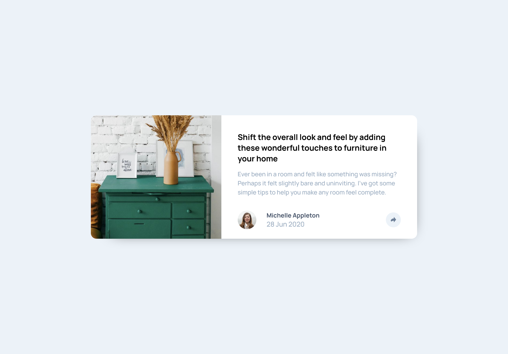
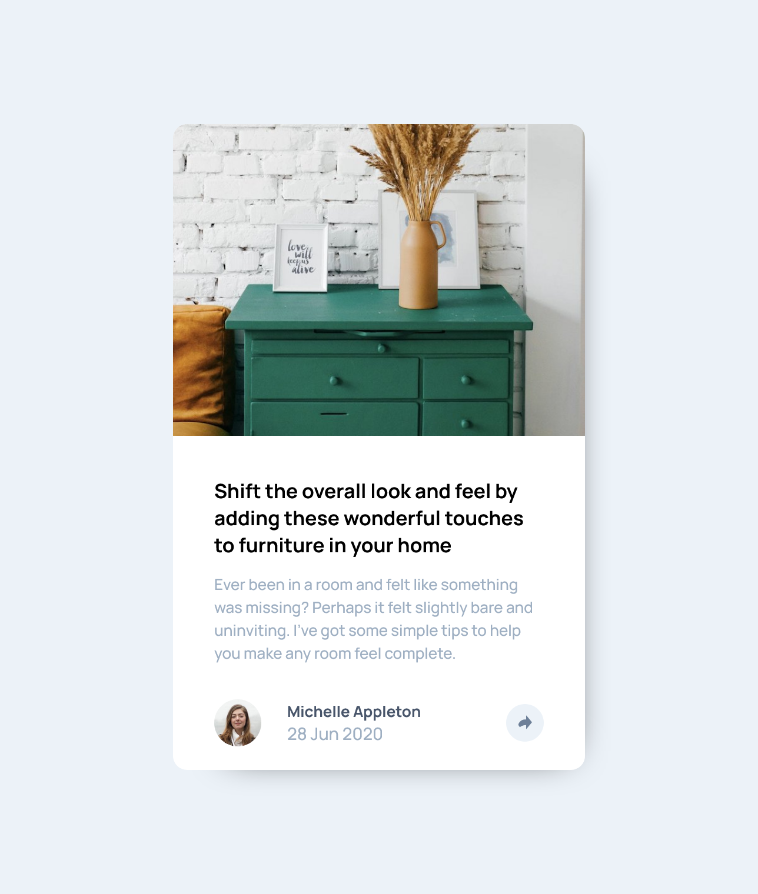

# Frontend Mentor - Article preview component solution

This is a solution to the [Article preview component challenge on Frontend Mentor](https://www.frontendmentor.io/challenges/article-preview-component-dYBN_pYFT). Frontend Mentor challenges help you improve your coding skills by building realistic projects.

## Table of contents

- [Overview](#overview)
  - [The challenge](#the-challenge)
  - [Screenshot](#screenshot)
  - [Links](#links)
- [My process](#my-process)
  - [Built with](#built-with)
  - [What I learned](#what-i-learned)
  - [Useful resources](#useful-resources)
- [Author](#author)

## Overview

### The challenge

Users should be able to:

- View the optimal layout for the component depending on their device's screen size
- See the social media share links when they click the share icon

### Screenshot

 

### Links

- [Solution URL](https://github.com/LesmeFranco/learning-path/tree/main/HTML-CSS-JS/article-preview-component-master)
- [Live Site URL](https://lesmefranco.github.io/learning-path/HTML-CSS-JS/article-preview-component-master/)

## My process

### Built with

- Semantic HTML5 markup
- CSS custom properties
- Mobile-first workflow
- Flexbox
- CSS Grid

### What I learned

With this project, I learned how to work with a mobile-first approach, focusing first on building a solid layout for smaller screens and then adapting it for desktop using media queries. I also learned how to handle user interactions with JavaScript by listening to button events and toggling UI elements, making the component fully responsive and interactive.

### Useful resources

- [Web Dev HTML](https://web.dev/html) - This helped me to undersantd all the elemnents and html components. I really liked this pattern and will use it going forward.
- [Web Dev CSS](https://web.dev/css) - This is an amazing article which helped me finally understand CSS. I'd recommend it to anyone still learning this concept.

## Author

- Github- [LesmeFranco](https://github.com/LesmeFranco)
- Frontend Mentor - [@LesmeFranco](https://www.frontendmentor.io/profile/LesmeFranco)
