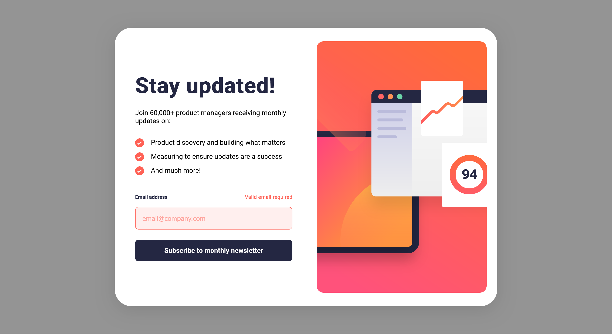

# Frontend Mentor - Newsletter sign-up form with success message solution

This is a solution to the [Newsletter sign-up form with success message challenge on Frontend Mentor](https://www.frontendmentor.io/challenges/newsletter-signup-form-with-success-message-3FC1AZbNrv). Frontend Mentor challenges help you improve your coding skills by building realistic projects.

## Table of contents

- [Overview](#overview)
  - [The challenge](#the-challenge)
  - [Screenshot](#screenshot)
  - [Links](#links)
- [My process](#my-process)
  - [Built with](#built-with)
  - [What I learned](#what-i-learned)
  - [Continued development](#continued-development)
  - [Useful resources](#useful-resources)
- [Author](#author)

## Overview

### The challenge

Users should be able to:

- Add their email and submit the form
- See a success message with their email after successfully submitting the form
- See form validation messages if:
  - The field is left empty
  - The email address is not formatted correctly
- View the optimal layout for the interface depending on their device's screen size
- See hover and focus states for all interactive elements on the page

### Screenshot




### Links

- [Solution URL](https://github.com/LesmeFranco/learning-path/tree/main/HTML-CSS-JS/newsletter-sign-up-with-success-message-main)
- [Live Site URL](https://newsletter-sign-up-jade-nine.vercel.app/)

## My process

### Built with

- Semantic HTML5 markup
- CSS custom properties
- Flexbox
- CSS Grid
- Mobile-first workflow

### What I learned

With this project, I significantly improved my understanding of how to work with forms using JavaScript, focusing on validating user input and managing form states effectively. I learned how to ensure that the data entered by the user meets the required conditions before proceeding.

Additionally, I gained experience in implementing responsive images by displaying different assets depending on the screen size, using the HTML <picture> element:

```html
<picture>
  <source
    media="(min-width: 768px)"
    srcset="./assets/images/illustration-sign-up-desktop.svg"
  />
  
</picture>
```

Another important concept I learned was how to control the visibility of elements based on the current state of the page, such as displaying validation errors or hiding them when the input becomes valid:

```javascript
function showError() {
  emailInput.classList.add("error");
  errorMessage.classList.remove("hidden");
}

function hideError() {
  emailInput.classList.remove("error");
  errorMessage.classList.add("hidden");
}
```

### Useful resources

- [Web Dev HTML](https://web.dev/html) - This helped me to undersantd all the elemnents and html components. I really liked this pattern and will use it going forward.
- [Web Dev CSS](https://web.dev/css) - This is an amazing article which helped me finally understand CSS. I'd recommend it to anyone still learning this concept.

## Author

- Github- [LesmeFranco](https://github.com/LesmeFranco)
- Frontend Mentor - [@LesmeFranco](https://www.frontendmentor.io/profile/LesmeFranco)
