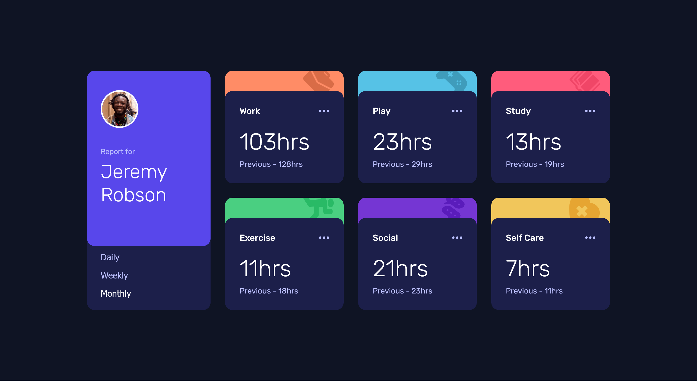
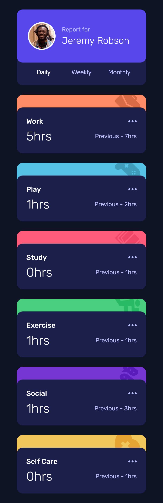

# Frontend Mentor - Time tracking dashboard solution

This is a solution to the [Time tracking dashboard challenge on Frontend Mentor](https://www.frontendmentor.io/challenges/time-tracking-dashboard-UIQ7167Jw). Frontend Mentor challenges help you improve your coding skills by building realistic projects.

## Table of contents

- [Overview](#overview)
  - [The challenge](#the-challenge)
  - [Screenshot](#screenshot)
  - [Links](#links)
- [My process](#my-process)
  - [Built with](#built-with)
  - [What I learned](#what-i-learned)
  - [Useful resources](#useful-resources)
- [Author](#author)

## Overview

### The challenge

Users should be able to:

- View the optimal layout for the site depending on their device's screen size
- See hover states for all interactive elements on the page
- Switch between viewing Daily, Weekly, and Monthly stats

### Screenshot




### Links

- [Solution URL](https://github.com/LesmeFranco/learning-path/tree/main/HTML-CSS-JS/time-tracking-dashboard-main)
- [Live Site URL](https://time-tracking-dashboard-gold-three.vercel.app/)

## My process

### Built with

- Semantic HTML5 markup
- CSS custom properties
- Flexbox
- CSS Grid
- Mobile-first workflow

### What I learned

In this project, I worked with JavaScript to manipulate data from a file called **data.json**. I accomplished this using the Fetch API:

```js
fetch("./data.json")
  .then((response) => {
    if (!response.ok) return console.log("Oops! Something went wrong.");
    return response.json();
  })
  .then((data) => {
    json = data;
  });
```

Additionally, I deepened my understanding of CSS Grid and how to properly display cards while ensuring responsiveness.

### Useful resources

- [Web Dev HTML](https://web.dev/html) - This helped me to undersantd all the elemnents and html components. I really liked this pattern and will use it going forward.
- [Web Dev CSS](https://web.dev/css) - This is an amazing article which helped me finally understand CSS. I'd recommend it to anyone still learning this concept.

## Author

- Github- [LesmeFranco](https://github.com/LesmeFranco)
- Frontend Mentor - [@LesmeFranco](https://www.frontendmentor.io/profile/LesmeFranco)
