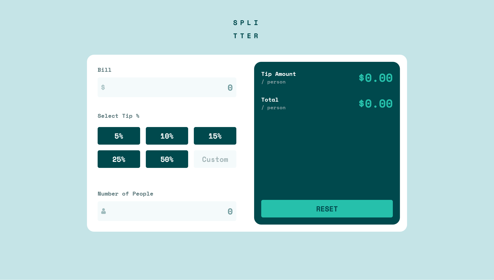
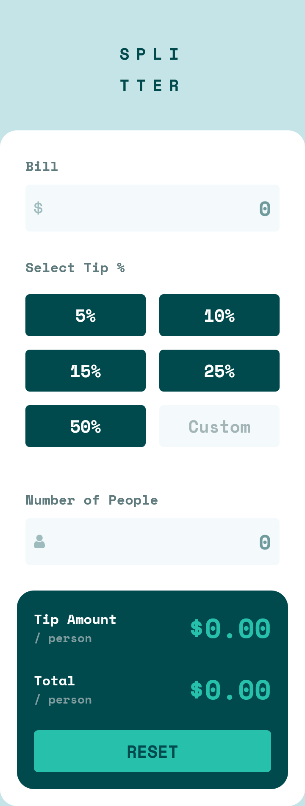

# Frontend Mentor - Tip Calculator App Solution

This is a solution to the [Tip Calculator App Challenge on Frontend Mentor](https://www.frontendmentor.io/challenges/tip-calculator-app-ugJNGbJUX). Frontend Mentor challenges help you improve your coding skills by building realistic projects.

## Table of Contents

- [Overview](#overview)
  - [The Challenge](#the-challenge)
  - [Features](#features)
  - [Screenshots](#screenshots)
  - [Links](#links)
- [My Process](#my-process)
  - [Built With](#built-with)
  - [What I Learned](#what-i-learned)
  - [Continued Development](#continued-development)
  - [Useful Resources](#useful-resources)
- [Installation](#installation)
- [Usage](#usage)
- [Author](#author)

## Overview

### The Challenge

Users should be able to:

- View the optimal layout for the app depending on their device's screen size
- See hover states for all interactive elements on the page
- Calculate the correct tip and total cost of the bill per person

### Features

- **Responsive Design**: Adapts to different screen sizes for optimal viewing on desktop and mobile devices.
- **Interactive Elements**: Hover effects on buttons and inputs for better user experience.
- **Accurate Calculations**: Computes tip amounts and total cost per person based on bill amount, tip percentage, and number of people.
- **Custom Tip Input**: Allows users to enter a custom tip percentage.
- **Reset Functionality**: Clears all inputs and results with a single button.

### Screenshots




### Links

- [Solution URL](https://github.com/LesmeFranco/learning-path/tree/main/HTML-CSS-JS/tip-calculator-app-main)
- [Live Site](https://lesmefranco.github.io/learning-path/HTML-CSS-JS/tip-calculator-app-main/)

## My Process

### Built With

- **Semantic HTML5** markup
- **CSS Custom Properties** for consistent styling
- **Flexbox** and **CSS Grid** for layout
- **Mobile-first Workflow** for responsive design
- **Vanilla JavaScript** for interactivity

### What I Learned

During this project, I learned how to manipulate buttons and inputs with JavaScript to create a responsive calculator. Key takeaways include:

- Handling user input validation and dynamic updates.
- Implementing responsive design using CSS media queries.
- Using event listeners for interactive elements.

### Continued Development

In future iterations, I plan to:

- Add more customization options, such as different themes.
- Implement local storage to save user preferences.
- Enhance accessibility features for better usability.

### Useful Resources

- [Web Dev HTML](https://web.dev/learn/html) - This helped me understand all the elements and HTML components. I really liked this pattern and will use it going forward.
- [Web Dev CSS](https://web.dev/learn/css) - This is an amazing article which helped me finally understand CSS. I'd recommend it to anyone still learning this concept.

## Installation

1. Clone the repository:
   ```bash
   git clone https://github.com/LesmeFranco/learning-path.git
   ```
2. Navigate to the project directory:
   ```bash
   cd learning-path/HTML-CSS-JS/tip-calculator-app-main
   ```
3. Open `index.html` in your preferred web browser.

## Usage

1. Enter the bill amount.
2. Select a tip percentage or enter a custom one.
3. Enter the number of people.
4. View the calculated tip amount and total per person.
5. Use the reset button to clear all inputs.

## Author

- **GitHub**: [LesmeFranco](https://github.com/LesmeFranco)
- **Frontend Mentor**: [@LesmeFranco](https://www.frontendmentor.io/profile/LesmeFranco)
