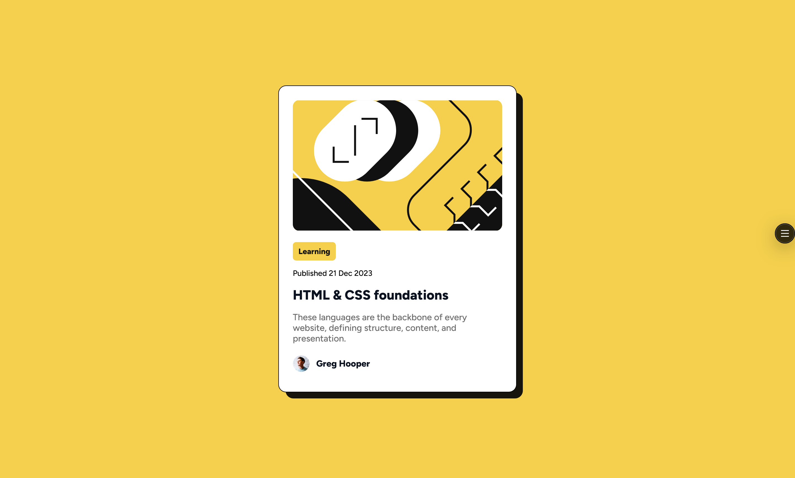

# Frontend Mentor - Blog preview card solution

This is a solution to the [Blog preview card challenge on Frontend Mentor](https://www.frontendmentor.io/challenges/blog-preview-card-ckPaj01IcS). Frontend Mentor challenges help you improve your coding skills by building realistic projects.

## Table of contents

- [Overview](#overview)
  - [The challenge](#the-challenge)
  - [Screenshot](#screenshot)
  - [Links](#links)
- [My process](#my-process)
  - [Built with](#built-with)
  - [What I learned](#what-i-learned)
  - [Continued development](#continued-development)
  - [Useful resources](#useful-resources)
- [Author](#author)

## Overview

### The challenge

Users should be able to:

- See hover and focus states for all interactive elements on the page

### Screenshot



### Links

- [Solution URL](https://github.com/LesmeFranco/learning-path/tree/main/HTML-CSS/blog-preview-card-main)
- [Live Site URL](https://lesmefranco.github.io/learning-path/HTML-CSS/blog-preview-card-main/)

## My process

### Built with

- Semantic HTML5 markup
- CSS custom properties
- Deployed on Vercel

### What I learned

During this project I focused on matching a pixel-accurate design while keeping the HTML semantic and the CSS simple and reusable. Key takeaways:

- Local font loading with `@font-face` and `font-display: swap` to avoid layout shifts and improve perceived performance.
- Building an offset shadow using a pseudo-element (`.card::after`) so the white card can sit visually above a darker drop shadow.
- Using `aspect-ratio` (or fixed heights when necessary) to keep the header image proportioned and to avoid layout shifts across viewports.
- Managing spacing and typography with component-level rules (rather than over-specific selectors) to make responsive adjustments easier.
- Ensuring interactive elements have visible hover and focus states for keyboard accessibility.

Small examples taken from the project:

```css
/* local font */
@font-face {
  font-family: "Figtree";
  src: url("../assets/fonts/static/Figtree-Medium.ttf") format("truetype");
  font-display: swap;
}

/* offset shadow */
.card::after {
  content: "";
  position: absolute;
  right: -18px;
  bottom: -18px;
  width: 100%;
  height: 100%;
  background: rgba(10, 10, 10, 0.95);
  border-radius: 14px;
  z-index: -1;
}
```

### Continued development

Areas I'm planning to improve or explore further:

- Refine responsive spacing and typographic scale so headings wrap more predictably at narrow widths.
- Improve accessibility: add ARIA labels where helpful, test tab order, and tune focus outlines for high contrast and visibility.
- Replace some static assets with optimized SVGs or responsive `srcset` images to reduce load time on mobile.
- Experiment with a small component-based CSS approach (CSS Modules, BEM or utility classes) to make styles easier to scale across projects.
- Add a simple visual regression step (e.g. Percy or Storybook snapshots) to catch accidental visual changes while iterating.

These improvements will make the component more robust and easier to reuse in larger projects.

### Useful resources

- [Web Dev HTML](https://web.dev/html) - This helped me to undersantd all the elemnents and html components. I really liked this pattern and will use it going forward.
- [Web Dev CSS](https://web.dev/css) - This is an amazing article which helped me finally understand CSS. I'd recommend it to anyone still learning this concept.

## Author

- Github- [LesmeFranco](https://github.com/LesmeFranco)
- Frontend Mentor - [@LesmeFranco](https://www.frontendmentor.io/profile/LesmeFranco)
