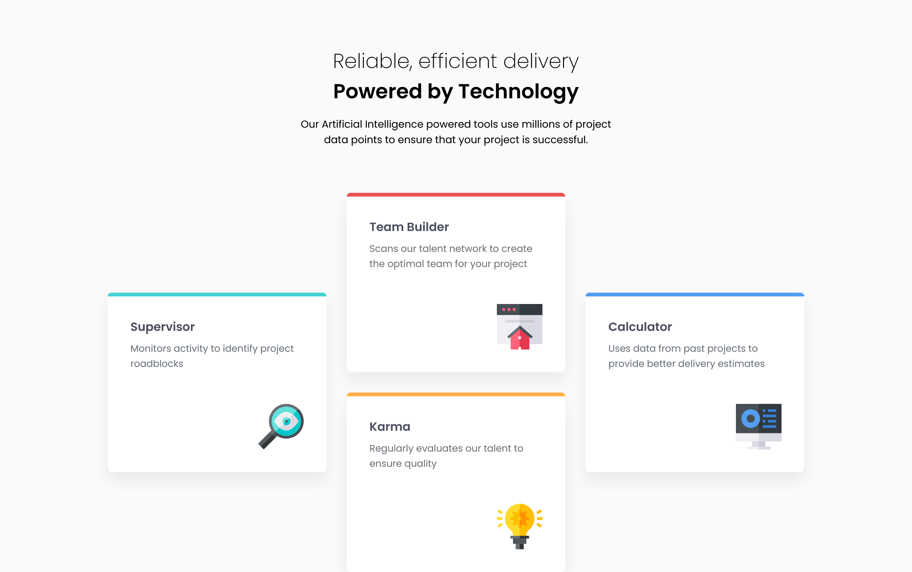
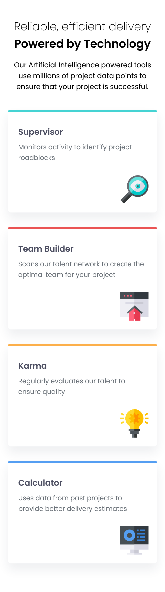

# Frontend Mentor - Four card feature section solution

This is a solution to the [Four card feature section challenge on Frontend Mentor](https://www.frontendmentor.io/challenges/four-card-feature-section-weK1eFYK). Frontend Mentor challenges help you improve your coding skills by building realistic projects.

## Table of contents

- [Overview](#overview)
  - [The challenge](#the-challenge)
  - [Screenshot](#screenshot)
  - [Links](#links)
- [My process](#my-process)
  - [Built with](#built-with)
  - [What I learned](#what-i-learned)
  - [Continued development](#continued-development)
  - [Useful resources](#useful-resources)
- [Author](#author)

## Overview

### The challenge

Users should be able to:

- View the optimal layout for the site depending on their device's screen size

### Screenshots

### Links

- Solution URL: [Add solution URL here](https://github.com/LesmeFranco/learning-path/tree/main/HTML-CSS/four-card-feature-section-master)
- Live Site URL: [Add live site URL here](https://lesmefranco.github.io/learning-path/HTML-CSS/four-card-feature-section-master/)

## My process

### Built with

- Semantic HTML5 markup
- CSS custom properties
- CSS Grid
- Mobile-first workflow
- Media Querys

### What I learned

I learned to work with media querys and to make the page for mobile devices first. To do this I learned how grid works in css and how to make the page responsive.

### Useful resources

- [Web Dev HTML](https://web.dev/html) - This helped me to undersantd all the elemnents and html components. I really liked this pattern and will use it going forward.
- [Web Dev CSS](https://web.dev/css) - This is an amazing article which helped me finally understand CSS. I'd recommend it to anyone still learning this concept.

## Author

- Github- [LesmeFranco](https://github.com/LesmeFranco)
- Frontend Mentor - [@LesmeFranco](https://www.frontendmentor.io/profile/LesmeFranco)
