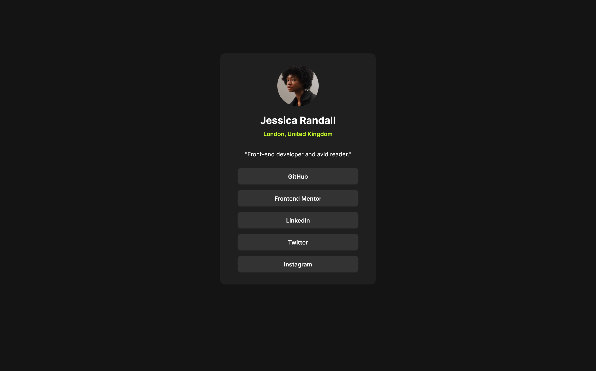

# Frontend Mentor - Social links profile solution

This is a solution to the [Social links profile challenge on Frontend Mentor](https://www.frontendmentor.io/challenges/social-links-profile-UG32l9m6dQ). Frontend Mentor challenges help you improve your coding skills by building realistic projects.

## Table of contents

- [Overview](#overview)
  - [The challenge](#the-challenge)
  - [Screenshot](#screenshot)
  - [Links](#links)
- [My process](#my-process)
  - [Built with](#built-with)
  - [What I learned](#what-i-learned)
  - [Continued development](#continued-development)
  - [Useful resources](#useful-resources)
- [Author](#author)

## Overview

### The challenge

Users should be able to:

- See hover and focus states for all interactive elements on the page

### Screenshot



### Links

- [Solution URL](https://github.com/LesmeFranco/learning-path/tree/main/HTML-CSS/social-links-profile-main)
- [Live Site URL](https://social-links-profile-five-rouge.vercel.app/)

## My process

### Built with

- Semantic HTML5 markup
- CSS custom properties (variables)
- Mobile-first responsive CSS
- Flexbox for layout and centering
- `@font-face` to load the Inter variable font
- Accessible, semantic links styled as buttons (no JavaScript required)

### What I learned

During this project I focused on building a clean, accessible and responsive UI following a mobile-first approach. Key takeaways:

- Centering and layout

  - Learned how using a flex container on the `body` plus an inner `.page` wrapper keeps the visual gutter while allowing precise vertical/horizontal centering.

- Mobile-first & responsive design

  - Built styles mobile-first and added media queries for larger breakpoints so the card scales well on phones, tablets and desktop.

- Buttons from semantic links

  - Styled `<a>` elements as full-width, keyboard-focusable buttons with `:focus-visible` for accessibility. This keeps semantics (links remain links) while matching the visual design.

Example: accessible button link pattern used in the project

```html
<a class="btn" href="https://github.com/" target="_blank" rel="noopener"
  >GitHub</a
>
```

### Continued development

Planned improvements and things I'd like to explore next:

- Accessibility refinements

  - Add `aria-label` where link text needs more context, ensure correct focus order and add a "skip to content" link for keyboard users.

- Visual enhancements

  - Add small SVG icons to the social links, and consider micro-interactions (subtle scale/opacity changes) for improved feedback.

- Theming and user preferences

  - Implement a light/dark theme toggle using CSS custom properties and persist the user's preference in `localStorage`.

- Performance & tooling

  - Optimize assets (compress avatar image), add simple build tooling (prettier/eslint for larger projects) and consider deploying with a CI/CD pipeline.

- Progressive enhancements
  - Add simple animations with `prefers-reduced-motion` in mind and consider an optional JS layer for tracking clicks or analytics.

### Useful resources

- [Web Dev HTML](https://web.dev/html) - This helped me to undersantd all the elemnents and html components. I really liked this pattern and will use it going forward.
- [Web Dev CSS](https://web.dev/css) - This is an amazing article which helped me finally understand CSS. I'd recommend it to anyone still learning this concept.

## Author

- Github- [LesmeFranco](https://github.com/LesmeFranco)
- Frontend Mentor - [@LesmeFranco](https://www.frontendmentor.io/profile/LesmeFranco)
