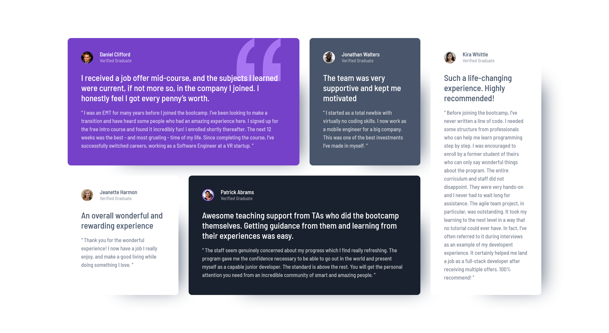

# Frontend Mentor - Testimonials grid section solution

This is a solution to the [Testimonials grid section challenge on Frontend Mentor](https://www.frontendmentor.io/challenges/testimonials-grid-section-Nnw6J7Un7). Frontend Mentor challenges help you improve your coding skills by building realistic projects.

## Table of contents

- [Overview](#overview)
  - [The challenge](#the-challenge)
  - [Screenshot](#screenshot)
  - [Links](#links)
- [My process](#my-process)
  - [Built with](#built-with)
  - [What I learned](#what-i-learned)
  - [Continued development](#continued-development)
  - [Useful resources](#useful-resources)
- [Author](#author)

## Overview

### The challenge

Users should be able to:

- View the optimal layout for the site depending on their device's screen size

### Screenshot




### Links

- [Solution URL](https://github.com/LesmeFranco/learning-path/tree/main/HTML-CSS/testimonials-grid-section-main)
- [Live Site URL](https://lesmefranco.github.io/learning-path/HTML-CSS/testimonials-grid-section-main/)

## My process

### Built with

- Semantic HTML5 markup
- CSS custom properties
- CSS Grid
- Mobile-first workflow

### What I learned

This project helped me deepen my understanding of CSS Grid and how powerful it is for building flexible, scalable layouts. I learned how to define both rows and columns using different units, how to structure a layout with grid-template-areas, and how to assign specific items to those areas using selectors like :nth-child().

I also improved my ability to make components responsive by adapting the grid structure depending on the screen size. This made me understand how grid can replace complex flexbox setups when working with multi-section layouts.

Some examples of what I learned:

```css
grid-template-areas:
  "one"
  "two"
  "three"
  "four"
  "five";
```

```css
.testimonial:nth-child(1) {
  grid-area: one;
}
.testimonial:nth-child(2) {
  grid-area: two;
}
.testimonial:nth-child(3) {
  grid-area: three;
}
.testimonial:nth-child(4) {
  grid-area: four;
}
.testimonial:nth-child(5) {
  grid-area: five;
}
```

I also practiced using fixed units (like px) together with flexible units (like fr) to control how the grid expands or shrinks, and I reinforced key concepts like implicit vs. explicit grids, alignment, and grid-flow behavior.

### Continued development

I want to keep improving my layout skills, especially with CSS Grid and Flexbox, since they’re essential for building modern, responsive interfaces. My next goals are:

- Practicing more complex, multi-column grid layouts
- Combining media queries with grid to create adaptive designs
- Improving my understanding of flexible units (fr, %, minmax(), auto)
- Getting more comfortable choosing the right tool between grid and flexbox depending on the layout pattern

I’ll keep building more Frontend Mentor projects to solidify these concepts and continue pushing my abilities.

### Useful resources

- [Web Dev HTML](https://web.dev/html) - This helped me to undersantd all the elemnents and html components. I really liked this pattern and will use it going forward.
- [Web Dev CSS](https://web.dev/css) - This is an amazing article which helped me finally understand CSS. I'd recommend it to anyone still learning this concept.

## Author

- Github- [LesmeFranco](https://github.com/LesmeFranco)
- Frontend Mentor - [@LesmeFranco](https://www.frontendmentor.io/profile/LesmeFranco)
